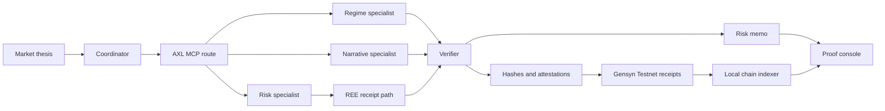
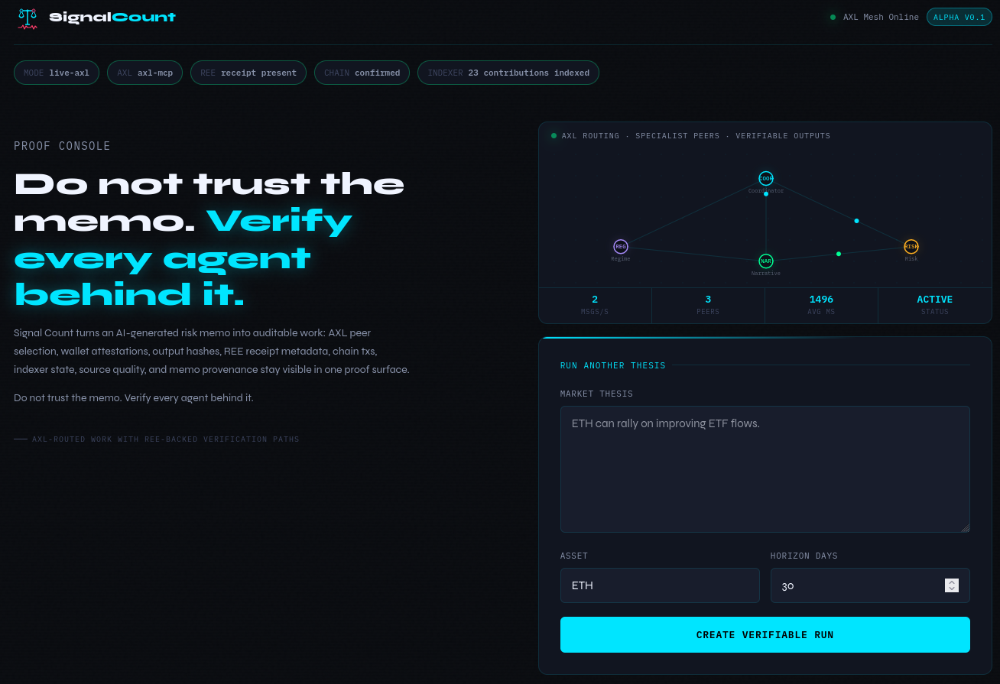
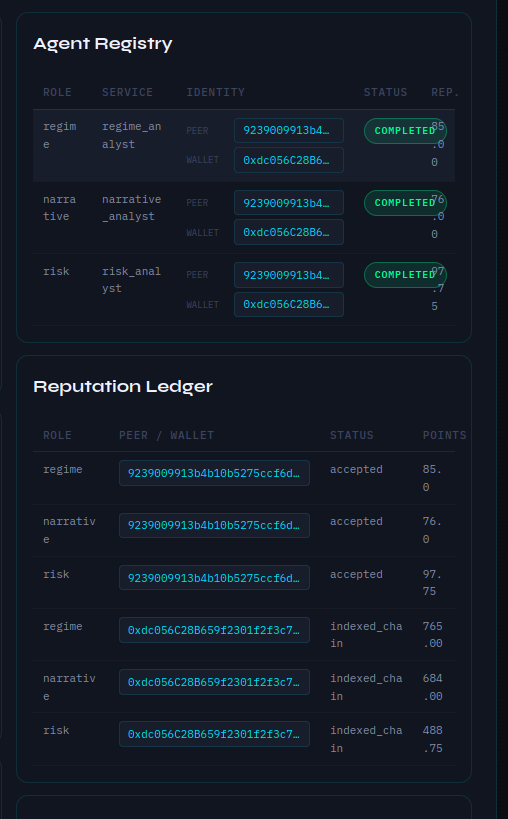
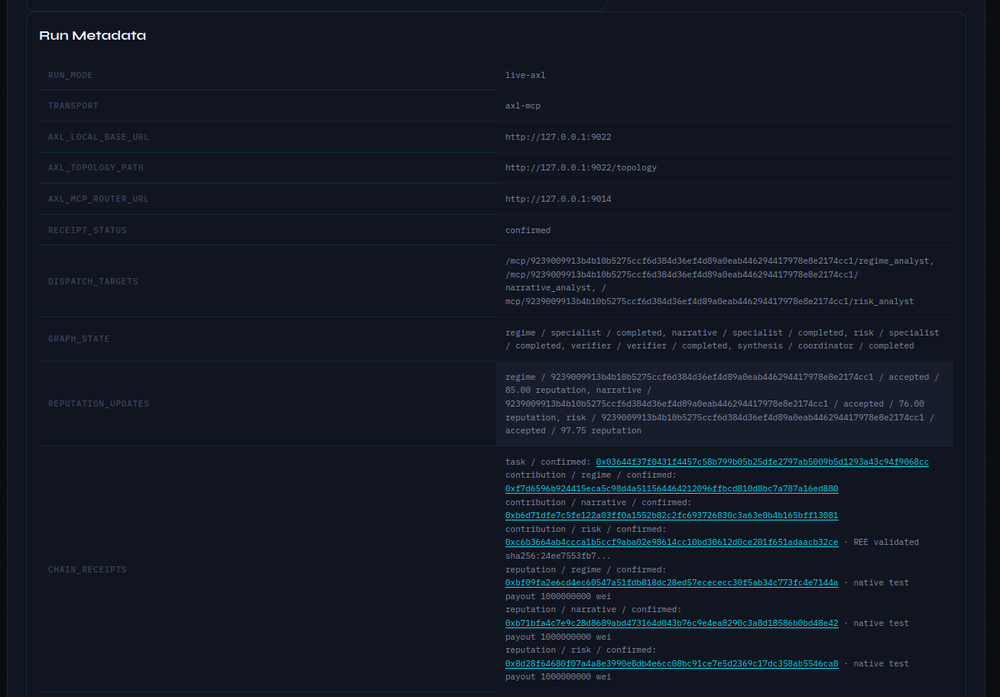

# Signal Count

Proof console for AXL-routed market thesis review in the ETHGlobal OpenAgents /
Gensyn track.

Do not trust the memo. Verify every agent behind it.

Signal Count is not a trading bot. A user submits one market thesis, an asset,
and a time horizon. A coordinator dispatches structured analysis requests to
specialist services through AXL, collects their responses, and produces an
auditable risk memo with scenarios, catalysts, risks, invalidation triggers,
and provenance.

Each completed run exposes the AXL peer, wallet, output hash, verifier
attestation, REE evidence when enabled, and Gensyn Testnet receipts when
configured.

## What It Does

- Accepts a single market thesis through a FastAPI API or proof-console UI.
- Routes work to specialist roles for regime, narrative, and risk analysis.
- Records node participation, peer IDs, latency, and topology snapshots.
- Scores specialist outputs through a verifier and records deterministic
  attestation hashes.
- Can attach a real Gensyn REE receipt to the risk specialist path.
- Can record task, contribution, and reputation receipt metadata on Gensyn
  Testnet when chain writing is configured.
- Produces a structured memo instead of a generic chat response.
- Renders an operator proof console with AXL peer, wallet, output hash, REE
  status, explorer links, indexed chain facts, and a source-linked memo.
- Degrades explicitly when a specialist is unavailable.

## Why AXL

The coordinator is designed to talk to its local AXL HTTP bridge and address
specialist services by peer ID and service name:

```text
/mcp/{peer_id}/{service_name}
```

That keeps the swarm boundary visible in the product: the demo can show which
peers participated in a run, rather than hiding all analysis inside one local
process.

## Architecture

```text
User / Demo UI
  |
FastAPI API
  |
Coordinator
  |
Local AXL bridge
  |
AXL specialist peers
  |-- Regime analyst
  |-- Narrative analyst
  |-- Risk analyst
  |
Verifier
  |
Memo synthesis + provenance ledger
```



## Screenshots

### Main Proof Console



### Agent Registry And Reputation



### Chain Receipts And Metadata



## Repository Layout

```text
app/
  api/              FastAPI routes
  axl/              AXL registry and client layer
  chain/            Gensyn Testnet transaction and receipt/reputation helpers
  coordinator/      Dispatch and memo synthesis workflow
  evaluation/       Verifier scoring, attestation, and reputation helpers
  integrations/     LLM, market data, and news adapters
  nodes/            Specialist service implementations
  ree/              Gensyn REE runner and receipt validation
  observability/    Metrics, tracing, provenance records
  orchestration/    Declared workflow graph and per-node graph state
  rendering/        Memo rendering
  schemas/          Pydantic contracts
  store/            SQLite-backed job store
  templates/        Proof-console UI
docs/
  ARCHITECTURE.md   Public architecture notes
  final-submission.md Final claim/evidence checklist
  spec.md           Product specification
tests/              Unit and integration tests
```

## Setup

```bash
python -m venv .venv
source .venv/bin/activate
pip install -r requirements-dev.txt -e .
```

## Run

```bash
uvicorn app.main:app --reload
```

Open:

```text
http://127.0.0.1:8000
```

## Offline Demo Preview

Use this mode when capturing stable screenshots without a live AXL bridge:

```bash
scripts/run_offline_demo.sh
```

The UI labels the topology as `offline-demo-preview` so it is not confused with
a live AXL run.

To preview partial-failure behavior without a live AXL mesh:

```bash
scripts/run_offline_partial_demo.sh
```

By default this forces the `risk` specialist to time out and verifies that the
memo is marked as partial instead of fabricating a missing node response.

## Live AXL Mode

Live mode expects the Gensyn AXL node and MCP router to be running. The
specialist server registers itself with the local MCP router using
`POST /register` and exposes `POST /mcp` for routed specialist requests.

Start the AXL MCP router first:

```bash
python -m mcp_routing.mcp_router --port 9003
```

Then run the three specialist services in separate terminals:

```bash
scripts/run_node_regime.sh
```

```bash
scripts/run_node_narrative.sh
```

```bash
scripts/run_node_risk.sh
```

Finally run the coordinator app with its local AXL bridge URL:

```bash
scripts/run_app_live.sh
```

Useful checks:

```bash
scripts/check_axl.sh
```

Optional multi-candidate routing:

```bash
export RISK_PEER_CANDIDATES="peer-risk-a:risk_analyst,peer-risk-b:risk_analyst"
export REGIME_PEER_CANDIDATES="peer-regime-a:regime_analyst,peer-regime-b:regime_analyst"
export NARRATIVE_PEER_CANDIDATES="peer-narrative-a:narrative_analyst,peer-narrative-b:narrative_analyst"
```

When candidate env vars are set, the coordinator ranks candidates by AXL
topology health and verifier/reputation metadata when available. If the selected
peer fails, it retries the next candidate and records the fallback chain in
`Run Evidence`.

### Verified Local AXL Run

The current implementation has been verified against a locally running Gensyn
AXL node, MCP router, and three specialist services. The coordinator submitted a
job through:

```text
/mcp/{axl_public_key}/{service_name}
```

and recorded all three roles as completed with `transport=axl-mcp`:

```text
regime -> regime_analyst
narrative -> narrative_analyst
risk -> risk_analyst
```

This verifies the local AXL bridge plus MCP router path. It should not be
overstated as a multi-machine remote mesh unless separate AXL nodes with
distinct public keys are also running.

### Multi-Peer AXL Mesh Demo

For the strongest Gensyn demo, Signal Count can run with two local AXL nodes
that have distinct public keys:

```text
Coordinator app -> AXL node A -> AXL node B -> MCP router B -> specialist services
```

Prepare the mesh configs:

```bash
scripts/prepare_axl_mesh_demo.sh
```

Start the mesh in separate terminals:

```bash
scripts/run_axl_mesh_router.sh
scripts/run_axl_mesh_node_a.sh
scripts/run_axl_mesh_node_b.sh
```

Read the remote peer ID from Node B:

```bash
curl -fsS http://127.0.0.1:9024/topology
```

Then export `AXL_REMOTE_PEER_ID` and start the services:

```bash
export AXL_REMOTE_PEER_ID="<node-b-our_public_key>"
scripts/run_axl_mesh_specialist.sh regime
scripts/run_axl_mesh_specialist.sh narrative
scripts/run_axl_mesh_specialist.sh risk
scripts/run_app_mesh_live.sh
```

Check the mesh:

```bash
scripts/check_axl_mesh.sh
```

In this mode the coordinator uses Node A as its local bridge
(`AXL_LOCAL_BASE_URL=http://127.0.0.1:9022`) while the run evidence points each
specialist dispatch at Node B's public key. This demonstrates separate AXL peer
identities without claiming a remote multi-machine deployment.

### Full Battle Demo Script

For the video-ready path, use the full battle runner:

```bash
scripts/run_full_battle_demo.sh
```

It starts the local two-node AXL mesh, MCP router, three specialist services,
the coordinator app, REE-backed risk execution, Gensyn Testnet receipt writes,
tiny capped native test-ETH payouts, a one-shot chain indexer, and the web
viewer. Terminal output is formatted into clear demo sections while
`.runtime/full-battle/summary.txt` remains plain text for evidence sharing.

Default viewer URL:

```text
http://127.0.0.1:8004
```

Stop the demo processes with:

```bash
scripts/stop_full_battle_demo.sh
```

Current verified full-battle evidence from the May 2, 2026 recording run:

- Job ID: `3beec5c8-3a95-4058-8962-9408fb951465`.
- Runtime: `773s` end to end.
- Live job completed at `+760s`; the remaining time was one-shot indexing and
  evidence summary generation.
- Roles completed: `regime`, `narrative`, `risk`.
- REE receipt status: `validated`.
- Chain receipts: task, three contributions, and three reputation/test payout
  receipts.
- Native test payout size: `1000000000 wei` per role.
- Indexed projection after replay: `tasks=9`, `contributions=23`,
  `verifications=0`, `reputation=23`.

## Proof Console UI

The browser UI has been upgraded from a simple demo page into a proof console:

- Capability strip shows live mode, AXL transport, REE presence, chain receipt
  status, and indexed contribution count.
- The thesis form stays at the top of the page, and the latest completed run
  opens directly below it on the verification/proof ledger surface.
- Replayable fixtures remain available below the completed proof surface.
- Demo fixtures remain replayable for stable walkthroughs.
- Latest run is split into `Run Timeline`, `Risk Memo`, and `Proof Ledger`.
- Proof ledger exposes agent registry, task trace, full hashes, REE status,
  explorer links, reputation evidence, indexed events, run metadata, and
  topology.
- Long peer IDs, hashes, and tx links wrap safely for laptop and mobile widths.

## Proof Layer

Signal Count's proof path is intentionally explicit:

```text
AXL dispatch evidence
  -> specialist output hash
  -> verifier attestation and score
  -> optional REE receipt hash/status
  -> optional Gensyn Testnet receipt/reputation tx
  -> indexed chain-event projection
```

What is verified locally:

- The live AXL path reaches specialist `/mcp` services through the local AXL
  bridge and MCP router.
- The same-machine two-node mesh demonstrates distinct AXL peer identities.
- REE receipt parsing and hash validation are covered by tests, and the real
  REE E2E script has been run against Gensyn REE.
- Gensyn Testnet task/contribution/reputation transaction helpers and receipt
  metadata are covered by tests; previously broadcast deployment and live job
  receipts are documented in `docs/gensyn-contracts.md`.
- The event indexer can rebuild task, contribution, verification,
  finalization, and reputation projections from indexed chain logs.

What is not claimed:

- No remote multi-machine AXL deployment unless the mesh scripts are run on
  separate hosts.
- No ERC20, USDC, stablecoin, or real-money reward flow.
- Native test-ETH payout evidence is opt-in, capped, tiny, and only for testnet.
- No full archival chain reorg rollback beyond the configured repair window.

## Test

```bash
python -m pytest tests/ -q --tb=short
ruff check app/ tests/
ruff format --check app/ tests/
```

Current local verification:

```text
150 passed, 1 skipped in socket-restricted sandbox
ruff check .: pass
ruff format --check .: pass
```

## Submission Notes

- Category: AI
- Emoji: ⚖️
- Short description: Proof console for AXL-routed AI analyst work: verify every
  agent behind the memo.

## AI Usage

AI tools were used during development for implementation assistance, test
iteration, and wording support. Product design, architecture choices, scope
control, AXL integration boundaries, and final submission decisions are
human-directed.
